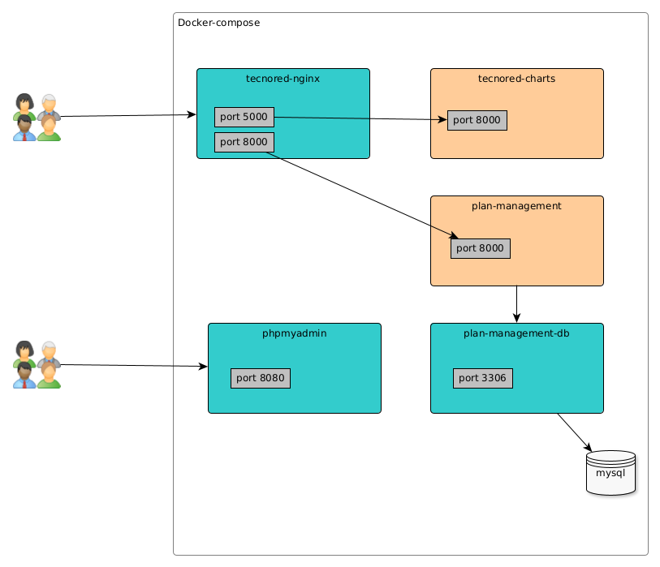

## Docker Compose Arcuitecture

## Project structure

Folders:

- docker-compose: have the configuration to deploy the platform using docker in a single host.
- digital-ocean: (future task) Maybe this folder contains a "platform as code" to make a deploy on digital ocean infraestructure

